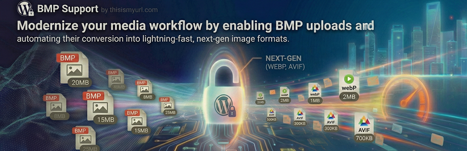

# BMP Support by thisismyurl

🔗 **[Register](https://thisismyurl.com/bmp-support-thisismyurl/#register)**

**BMP Support by thisismyurl** is a specialized performance utility designed for users who need to manage BitMap images without compromising their site�s speed or user experience.

Standard WordPress configurations often restrict BMP uploads because of their massive, uncompressed file sizes. This plugin removes that limitation, allowing you to upload `.bmp` files directly to your Media Library while providing a smart engine to convert them into modern, web-ready formats instantly.

### Why Optimization Matters
Large, uncompressed images are the leading cause of slow page speeds. By transforming heavy BMP files into **WebP** or **AVIF** upon upload, you maintain visual clarity while significantly reducing your site's storage and bandwidth footprint.

### Key Benefits & Features:
* **Enable BMP Uploads:** Safely unlock support for `.bmp` files within your WordPress Media Library.
* **Automated Image Conversion:** Instantly convert legacy BMP data into ultra-lightweight WebP or AVIF formats.
* **Smart Ecosystem Integration:** The plugin automatically recognizes our **WebP Support** and **AVIF Support** plugins to expand your optimization options.
* **Precision Quality Control:** Use integrated sliders in the Tools menu to find the perfect balance between quality and compression.
* **Lightweight Performance:** Built on our shared TIMU Core library to ensure a stable, bloat-free experience.

## ⚙️ Installation
1. Upload the `bmp-support-thisismyurl` folder to the `/wp-content/plugins/` directory.
2. Activate the plugin through the 'Plugins' menu in WordPress.
3. Navigate to **Tools > BMP Support** to configure your preferred handling and quality settings.

## ❓ FAQ
### Is this plugin free?
Yes! The core functionality of the BMP Support plugin is 100% free to download and use on your WordPress site.
### Why should I register for support?
While the plugin is free, registering your copy provides access to priority technical assistance and ensures you receive automatic updates directly in your dashboard. Registration helps us keep the plugin compatible and secure as WordPress evolves.
### How do I register?
Visit [https://thisismyurl.com/bmp-support-thisismyurl/#register](https://thisismyurl.com/bmp-support-thisismyurl/#register) to sign up for a support license. Once you have your key, enter it into the "License Key" field in the plugin settings to unlock support.
### Does this delete my original BMP files?
The plugin is designed to process your imagery based on your settings. If you select a conversion format (like WebP), it generates an optimized version for web use while adhering to your specified handling mode.

## 🗺️ Roadmap & Activity

---
([char]0x00A9) 2026 [thisismyurl](https://thisismyurl.com)